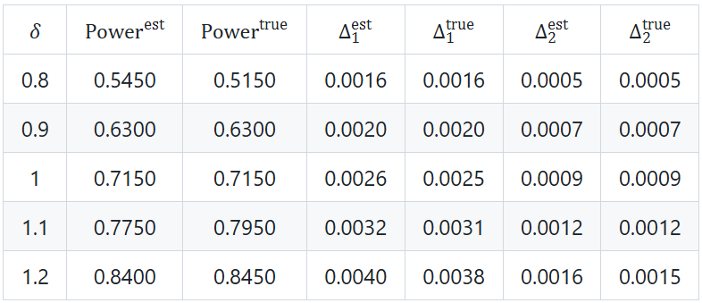
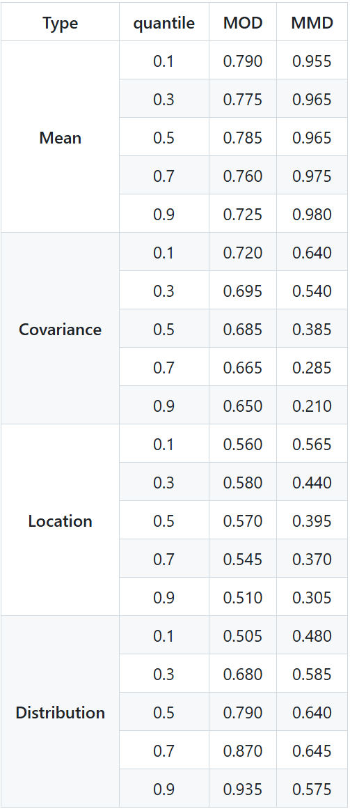
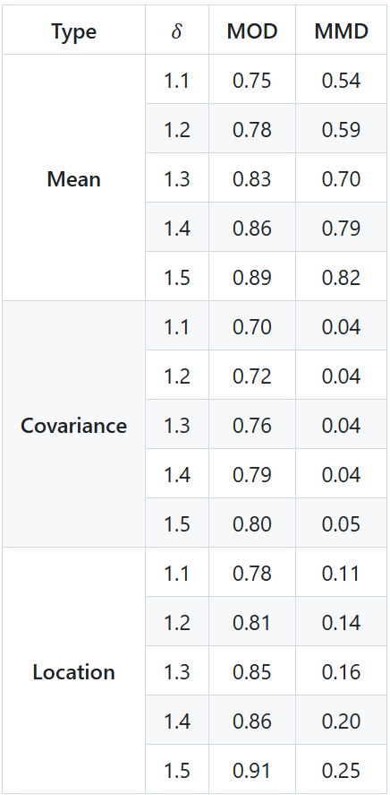

**Table C.1. Power Comparison under two covariance matrices.**

**Table C.2. Power comparison between MOD and MMD under different bandwidths.**

**Table C.3. Power comparison of MOD and MMD for a modified version of Experiment III, in which only $5\%$ of the observations in $Y$ are drawn from a shifted alternative distribution.**

**Figure C.1. Histograms of for $T_i$ and $T_i^2$ for one replication.**

